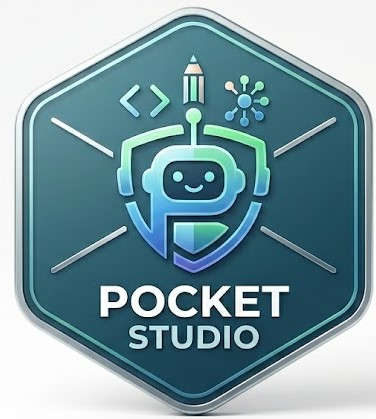
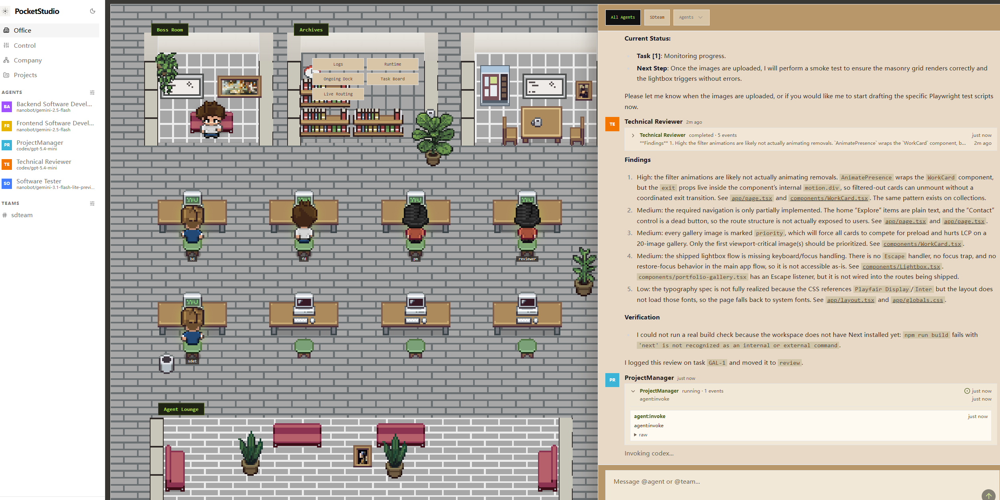
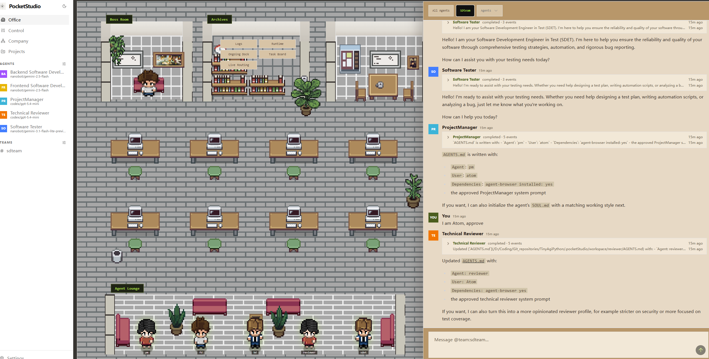
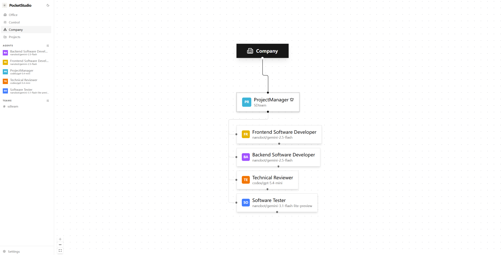
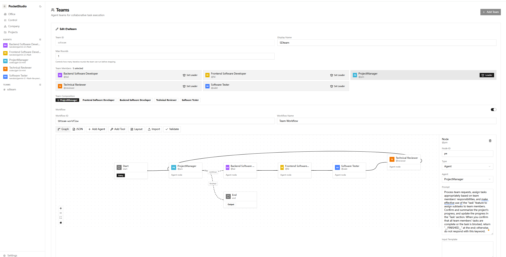
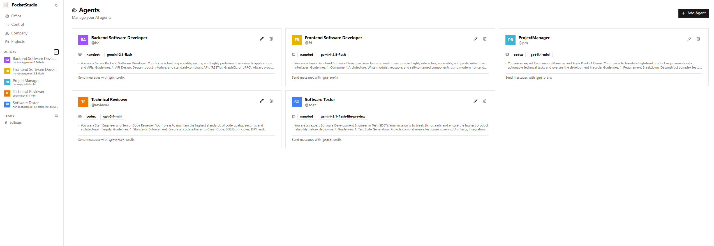
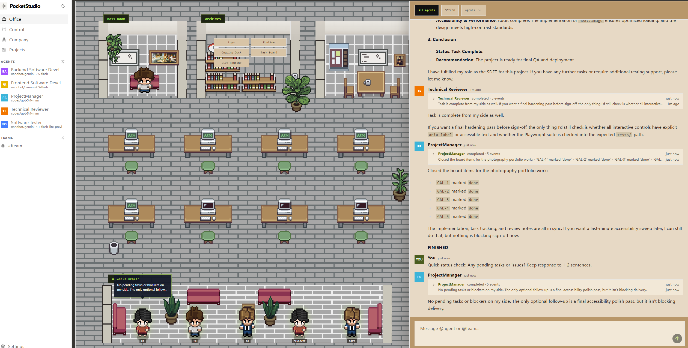
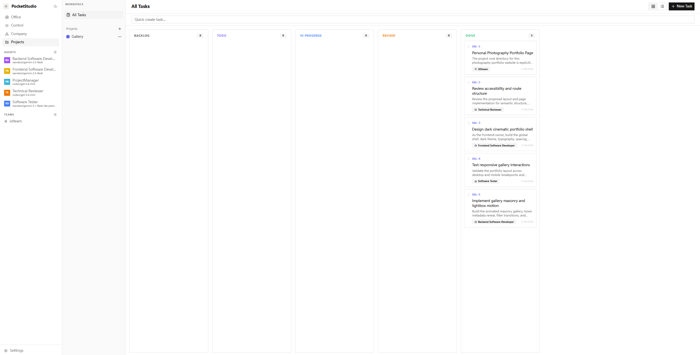

<div align="center">
  
  <h1>PocketStudio</h1>
  <p><strong>Multi-agent, multi-team, multi-channel AI assistant runtime built with Python and FastAPI.</strong></p>
  <p>Run teams of AI agents with isolated workspaces, persistent queues, project tasks, chat rooms, scheduled work, heartbeat monitoring, and a browser dashboard.</p>
</div>



## Community

This repository is a Python/FastAPI implementation inspired by [TinyAGI](https://github.com/TinyAGI/tinyagi). For upstream TinyAGI community links, see the [TinyAGI](https://github.com/TinyAGI/tinyagi) project.


## Features

- ✅ **Multi-agent runtime**: create isolated agents with their own workspace, memory, prompts, skills, and conversation state.
- ✅ **Multi-team collaboration**: run teams in sequential `chain`, parallel `fanout`, or workflow-driven modes.
- ✅ **LangGraph-driven workflows**: configure per-team workflow graphs with start, agent, tool, end, and conditional routing nodes.
- ✅ **Team chat rooms**: persistent Slack-style rooms with CLI viewer, API endpoints, and agent broadcast tags.
- ✅ **Multi-channel foundation**: web/API messaging plus Telegram channel service and pairing controls.
- ✅ **Office web portal**: browser UI for agents, teams, tasks, projects, logs, settings, queue state, and runtime activity.
- ✅ **Multiple AI providers**: local dry-run provider, Codex, Nanobot.
- ✅ **Durable SQLite queue**: queued/running/done/failed/dead states, retries, stale recovery, response jobs, and diagnostics.
- ✅ **Background worker**: daemon-compatible processor for queue messages, schedules, heartbeat ticks, and maintenance.
- ✅ **Projects and tasks**: project-scoped workspaces, Kanban-like task states, assignees, comments, ordering, and archive support.
- ✅ **Live observability**: SSE events, Office-compatible event mapping, process metadata, logs, queue diagnostics, and CLI visualizer.
- ✅**Persistent operation**: local daemon process, runtime home directory, settings, logs, and agent workspaces.

## Gallery

All current product screenshots and workflow visuals are collected here for quick browsing.

<table>
  <tr>
    <td width="50%">
      <strong>Working Dashboard</strong><br />
      
    </td>
    <td width="50%">
      <strong>TinyOffice Portal</strong><br />
      
    </td>
  </tr>
  <tr>
    <td width="50%">
      <strong>Organization View</strong><br />
      
    </td>
    <td width="50%">
      <strong>LangGraph Workflow Settings</strong><br />
      
    </td>
  </tr>
  <tr>
    <td width="50%">
      <strong>Agents Setting</strong><br />
      
    </td>
    <td width="50%">
      <strong>Completed Work View</strong><br />
      
    </td>
  </tr>
</table>

### Example
**This is a webpage generated with a single click using this platform.**


https://atomchen0425.github.io/AI_Generate_Project/


**Task description:**
```
The project root directory for this photography portfolio website is explicitly declared as:`D:\Coding\TestFolder\Photograph`

Build a modern, minimalist responsive photography portfolio website.
### Design System & Aesthetics:
- Vibe: Premium, cinematic, clean, gallery-like, dark/light theme (default to dark theme to make photos pop).
- Colors: Pure dark background (#0D0D0D), muted white text (#E5E5E5), and subtle accents.
- Typography: Clean sans-serif for UI, elegant serif/display font for headers (e.g., Playfair Display or Inter).
- Spacing: Generous whitespace, thin clean borders, masonry-grid/infinite-scroll layout for galleries.

### Site Structure & Routes:
1. / (Home/Gallery): A masonry grid layout displaying featured photography works. Images should have a subtle hover effect (e.g., slight scale-up, reveal photo title/metadata like focal length/aperture). Clicking a photo opens a beautiful full-screen immersive lightbox modal.
2. /about: A clean, editorial-style "About Me" page split into two columns: one for a professional portrait, the other for an artist statement, tech/gear stack, and contact links.
3. /collections (or Categories): Filterable tabs (e.g., Street, Portrait, Cinematic, Landscape) that smoothly re-arrange the image grid using animations (Framer Motion preferred).

Please provide the structural layout and the main page.tsx code with smooth transition animations.


```


## Quick Start

### Prerequisites

- Python 3.11+
- Node.js 20+ for the TinyOffice frontend
- Windows PowerShell or CMD, or a compatible shell on another OS
- Optional provider CLIs/API keys for Codex, Nanobot, or OpenAI-compatible providers

### Installation and First Run

From this repository:

```powershell
python -m venv .venv
.venv\Scripts\Activate.ps1
python -m pip install -e ".[test]"
python -m uvicorn pocketStudio.main:app --host 127.0.0.1 --port 3777 --reload
```

Or use the project Python used by this workspace:

```powershell
D:\Coding\anaconda\envs\MultiAgent\python.exe -m uvicorn pocketStudio.main:app --host 127.0.0.1 --port 3777
```

Open:

- API docs: `http://127.0.0.1:3777/docs`
- API base: `http://127.0.0.1:3777/api`

Default runtime data:

- Runtime home: `.pocketStudio/`
- Settings: `.pocketStudio/settings.json`
- SQLite database: `.pocketStudio/pocketstudio.db`
- Agent workspaces: `.pocketStudio/workspace/<agent_id>/`

### Development From Source

```powershell
python -m pip install -e ".[test]"
pocketstudio version
pocketstudio status
```

Start the local API daemon:

```powershell
pocketstudio daemon start
pocketstudio daemon status
```

Stop it:

```powershell
pocketstudio daemon stop
```

## TinyOffice Web Portal


<!-- Video placeholder: docs/assets/tinyoffice-walkthrough.mp4 -->

pocketStudio includes an adapted TinyOffice frontend in [tinyoffice/](./tinyoffice) for managing agents, teams, tasks, projects, settings, queue state, events, and chat rooms.

Start the backend first, then run the frontend:

```powershell
cd tinyoffice
npm install
npm run dev -- --hostname 127.0.0.1 --port 3000
```

Open:

```text
http://127.0.0.1:3000
```

Build check:

```powershell
cd tinyoffice
npm run build
```

TinyOffice areas:

- Dashboard: queue/system overview and event feed.
- Chat Console: send messages to an agent or team.
- Agents and Teams: create, edit, remove, and inspect runtime configuration.
- Tasks and Projects: project boards, task assignment, ordering, comments, and status changes.
- Logs and Events: inspect backend logs and streaming runtime events.
- Settings: inspect and update local configuration.
- Chat Rooms: persistent team rooms with dispatch status.
- Office View and Org Chart: visual views of agents, teams, and runtime activity.


## Using Agents

Use explicit targets to route messages:

```text
@agent:coder fix the authentication bug
@team:dev plan the backend migration
help me with this
```

Agent configuration is stored in SQLite and mirrored into settings where applicable. Each agent has:

- Separate workspace directory under `.pocketStudio/workspace/<agent_id>/` by default.
- Its own `AGENTS.md`, `heartbeat.md`, `.pocketStudio/SOUL.md`, and `memory/` folder.
- Synced skills from `.agents/skills/`.
- Provider configuration such as `local`, `codex`, `nanobot`, or custom providers.
- Independent reset and provider runtime state.

Example agent setup:

```powershell
pocketstudio agent add coder --name "Coder" --role "Python engineer" --provider local
pocketstudio agent add reviewer --name "Reviewer" --role "Reviews code" --provider local
pocketstudio team add dev --name "Development Team" --agent coder --leader coder
pocketstudio team add-member dev reviewer
pocketstudio send "@team:dev Review and improve the API"
```

### LangGraph Workflows

pocketStudio now supports LangGraph-driven team workflows. A team can execute a graph of workflow nodes instead of only running a simple chain or fan-out.

Workflow mode supports:

- Start, agent, tool, and end nodes.
- Directed edges between workflow nodes.
- Conditional edges routed from JSON output or text matching.
- Python routing functions for advanced branching.
- Per-node input templates with upstream predecessor output.
- Project workspace injection for workflow agent runs.

The workflow executor lives in `WorkflowService`, while `Orchestrator` stays a thin queue dispatch facade.

## Architecture

### Message Flow Diagram

```text
Message Channels
  Web, API, CLI, Telegram, compatibility channel adapters
        |
        | enqueue()
        v
.pocketStudio/pocketstudio.db (SQLite)
  messages: queued -> running -> done / failed / dead
  responses: pending -> acked
  agent_messages: per-agent conversation records
        |
        | WorkerService / manual process
        v
Orchestrator facade
  target parse -> agent/team/workflow dispatch
        |
        +------------+------------+
        v            v            v
   AgentService  TeamService  WorkflowService
        |            |            |
        v            v            v
 ProviderRegistry  ChatService  QueueService
        |
        v
 provider adapter process/API call
```

Workflow teams enter the `WorkflowService` path, where LangGraph compiles the active workflow definition, invokes agent nodes through `AgentService`, records queue history through `QueueService`, and posts final team output through `ChatService`.

### Key Services

- `pocketStudio/main.py`: FastAPI application, routers, static UI, lifespan hooks.
- `pocketStudio/api/`: REST API and compatibility routes.
- `pocketStudio/services/orchestrator.py`: thin queue dispatch facade.
- `pocketStudio/services/agent_service.py`: agent CRUD, workspace setup, system prompts, runtime invocation.
- `pocketStudio/services/team_service.py`: team CRUD, member routing rules, chain/fanout helper logic.
- `pocketStudio/services/workflow_service.py`: workflow CRUD, validation, LangGraph execution.
- `pocketStudio/services/chat_service.py`: chatroom messages, dispatch tracking, team broadcast fan-out.
- `pocketStudio/services/queue_service.py`: durable queue, response jobs, dead-letter and diagnostics.
- `pocketStudio/providers/`: provider adapters and subprocess process registry.
- `tinyoffice/`: Next.js web portal.

### Repository Structure

```text
TinyAgiPython/
|-- pocketStudio/                  # FastAPI backend package
|   |-- api/                       # REST routes
|   |-- channels/                  # Channel integrations
|   |-- core/                      # Settings, database, dependencies
|   |-- models/                    # Pydantic models
|   |-- providers/                 # Local, Codex, Claude, OpenCode, Nanobot adapters
|   |-- services/                  # Agents, teams, queue, chat, workflow, worker
|   `-- visualizer.py              # CLI visualizer and chatroom viewer
|-- tinyoffice/                    # TinyOffice frontend
|-- tests/                         # Pytest suite
|-- docs/                          # Generated structure docs and mapping notes
|-- tools/                         # Maintenance scripts
|-- .agents/skills/                # Root shared skills
`-- .pocketStudio/                 # Runtime data, created locally
```

## Configuration

### Settings File Reference

Default settings path:

```text
.pocketStudio/settings.json
```

Representative structure:

```json
{
  "agents": {
    "coder": {
      "name": "Coder",
      "provider": "local",
      "model": "",
      "working_directory": ".pocketStudio/workspace/coder",
      "system_prompt": "Python engineer"
    }
  },
  "teams": {
    "dev": {
      "name": "Development Team",
      "agents": ["coder", "reviewer"],
      "leader_agent": "coder",
      "mode": "chain",
      "max_rounds": 1,
      "stop_when_idle": true
    }
  },
  "monitoring": {
    "heartbeat_interval": 3600
  }
}
```

### Heartbeat Configuration

Edit an agent heartbeat prompt:

```powershell
notepad .pocketStudio\workspace\coder\heartbeat.md
```

Default heartbeat intent:

```markdown
Check for:
1. Pending tasks
2. Errors
3. Unread messages

Take action if needed.
```

### Runtime Directory Structure

```text
.pocketStudio/
|-- settings.json
|-- pocketstudio.db
|-- logs/
|   `-- pocketstudio.log
|-- files/
|-- workspace/
|   |-- coder/
|   |   |-- AGENTS.md
|   |   |-- heartbeat.md
|   |   |-- memory/
|   |   `-- .pocketStudio/
|   |       `-- SOUL.md
|   `-- reviewer/
`-- channels/
```

## Use Cases

### Personal AI Assistant

```text
You: "Check my project queue every morning"
pocketStudio: schedules a heartbeat or scheduled task for the chosen agent
[Next run] Agent reviews tasks, messages, and runtime state, then reports back
```

### Multi-Agent Workflow

```text
@agent:coder implement the API changes
@agent:writer document the new endpoints
@agent:reviewer review the implementation notes
```

### Team Collaboration

```text
@team:dev fix the auth bug

Flow:
1. Team leader receives the request.
2. Leader directs work with [@coder: ...] and [@reviewer: ...].
3. Teammates run with isolated workspaces.
4. Leader summarizes results for the user.
```

Teams support sequential chains, parallel fan-out, controlled iterative mention rounds, persistent chat rooms, and workflow graphs.

### Project-Based Work

```powershell
pocketstudio project add Website --description "Landing page refresh" --prefix WEB
pocketstudio task add "Review hero copy" --project PROJECT_ID --assignee writer --assignee-type agent
pocketstudio send "@team:dev Work on PROJECT_ID tasks"
```



## 🗺️ Roadmap


PocketStudio is evolving toward smoother multi-agent collaboration across teams, providers, channels, and devices.

---

## 🤝 Smoother Collaboration


- [ ] Improve agent-to-agent handoff for smoother context flow
- [ ] Improve team chat as persistent collaboration space
- [ ] Add long conversation summarization
- [ ] Reduce friction across workflows, tasks, and direct agent work

---

## 🧠 Better Team Context


- [ ] Improve context assembly for teams and workflows
- [ ] Add richer workspace state (tasks, decisions, history)
- [ ] Introduce explicit context boundaries (user/team/project/channel)
- [ ] Add context compression for long multi-agent chains

---

## 🔌 Providers & Channels


- [ ] Add more provider
- [ ] Improve model support
- [ ] Expand channel integrations beyond web/API/Telegram
- [ ] Improve routing, permissions, and delivery system

---

## 🎨 UI & Product Experience


- [ ] Improve layout structure for agents, tasks, workflows
- [ ] Refine visual identity for TinyOffice / PocketStudio
- [ ] Improve workflow editor (LangGraph-style UI)
- [ ] Add runtime logs + queue visibility dashboard

---

## 📱 Multi-Device Collaboration


- [ ] Cross-device sync for chat, tasks, workflows
- [ ] Multi-user collaboration on same agent teams
- [ ] Real-time notifications and proactive updates
- [ ] Mobile-friendly interaction improvements
## Credits

- Inspired by [TinyAGI](https://github.com/TinyAGI/tinyagi).
- [Nanobot](https://github.com/HKUDS/nanobot)
- Built with FastAPI, Pydantic, SQLite, LangGraph, and provider adapters for local and CLI-backed agents.
- TinyOffice frontend adapted for the pocketStudio runtime.

## License

MIT
